## Diagram UI — moduł logowania i rejestracji (Astro + React)

<architecture_analysis>
### 1) Komponenty / strony / moduły wymienione w dokumentacji (PRD + auth-spec)

**Z PRD (US-008 + zależności)**
- Dedykowane strony: logowanie, rejestracja.
- Przycisk w prawym górnym rogu (top bar w głównym layoucie): logowanie / wylogowanie.
- Odzyskiwanie hasła: powinno być możliwe.
- Brak zewnętrznych dostawców logowania (Google/GitHub) — tylko email+hasło.
- Ochrona danych (dostęp do aplikacji po zalogowaniu).

**Ze specyfikacji `@.ai/auth-spec.md`**
- Layouty:
  - `src/layouts/Layout.astro` — **rozszerzenie** o top bar + stan auth po SSR (pobranie usera przez `Astro.locals.supabase.auth.getUser()`), akcje login/logout.
  - `src/layouts/AuthLayout.astro` — **nowy** layout dla `/auth/*` (centered card).
- Strony auth (nowe, SSR, `prerender=false`):
  - `src/pages/auth/login.astro`
  - `src/pages/auth/register.astro`
  - `src/pages/auth/forgot-password.astro`
  - `src/pages/auth/reset-password.astro`
  - `src/pages/auth/callback.astro`
- Komponenty UI auth (nowe, minimalny zestaw):
  - `src/components/auth/SignInForm.tsx`
  - `src/components/auth/SignUpForm.tsx`
  - `src/components/auth/ForgotPasswordForm.tsx`
  - `src/components/auth/ResetPasswordForm.tsx`
  - `src/components/auth/AuthErrorAlert.tsx`
  - (opcjonalnie) `src/components/auth/AuthCard.*` oraz `src/components/auth/AuthLinks.tsx`
- Endpointy API auth (nowe, envelope JSON):
  - `POST /api/auth/sign-in`
  - `POST /api/auth/sign-up`
  - `POST /api/auth/sign-out`
  - `GET /api/auth/me`
  - `POST /api/auth/forgot-password`
  - `POST /api/auth/update-password`
- Warstwa walidacji (Zod) dla auth (nowe): `src/lib/api/auth/*`
- Serwisy auth (nowe): `src/lib/services/auth/*`
- Sesja: utrzymywana w **HttpOnly cookies** (Supabase SSR).
- Profile (US-020, minimalna zależność): `public.profiles` (nickname opcjonalny, timezone wymagany).
- Redirecty/guardy:
  - wejście na stronę chronioną bez sesji → redirect do logowania z parametrem powrotu,
  - wejście na `/auth/*` będąc zalogowanym → redirect do `next` lub strony startowej.

### 2) Elementy znalezione w codebase, które biorą udział w (lub dotykają) autentykacji

**SSR / Supabase / cookies**
- `src/middleware/index.ts` — tworzy `createServerClient` z `@supabase/ssr`, podpina cookie storage i zapisuje klienta do `context.locals.supabase` (**punkt integracji auth**).

**Autoryzacja w API (już istnieje)**
- `src/lib/api/auth/require-user-id.ts` — helper pobierający usera z cookies lub Bearer tokena i rzucający `HttpError(401, 'Unauthenticated', 'UNAUTHENTICATED')`.
- Endpointy API (plants/calendar/ai quota) używają `locals.supabase.auth.getUser()` i zwracają `UNAUTHENTICATED` przy braku sesji.

**UI aplikacji (już istnieje, strony SSR + React)**
- Strony aplikacyjne (Astro):
  - `src/pages/plants/*`, `src/pages/calendar/*` (SSR, `prerender=false`) — obecnie renderują widoki React w `Layout.astro`.
- Komponenty React i hooki:
  - liczne klienty API (`src/lib/services/**/**-client.ts`) mapują 401/`UNAUTHENTICATED` na stan `unauthenticated`,
  - wiele widoków UI buduje link do logowania w przypadku `unauthenticated` (np. lista roślin, szczegóły rośliny, edytor planu podlewania).

**Ważna obserwacja integracyjna**
- W repo UI już używa parametru powrotu `returnTo` (np. `.../auth/login?returnTo=...`), natomiast `auth-spec` opisuje `next`.
  - To wymaga ujednolicenia w implementacji (diagram pokazuje „Param powrotu”, a nie konkretną nazwę).

### 3) Główne strony i ich komponenty (mapowanie)

**Auth**
- Strona Logowania → `AuthLayout.astro` + `SignInForm.tsx` (+ `AuthErrorAlert.tsx`, linki do rejestracji i resetu hasła).
- Strona Rejestracji → `AuthLayout.astro` + `SignUpForm.tsx`.
- Strona Resetu Hasła (request) → `AuthLayout.astro` + `ForgotPasswordForm.tsx`.
- Strona Ustawienia Nowego Hasła → `AuthLayout.astro` + `ResetPasswordForm.tsx`.
- Strona Callback → SSR wymiana kodu na sesję i redirect do właściwej strony.

**Aplikacja (chroniona)**
- Lista roślin → `src/pages/plants/index.astro` + `PlantsListView.tsx`.
- Kalendarz miesiąca/dnia → strony `src/pages/calendar/*` + `CalendarMonthView.tsx` / `CalendarDayView.tsx` (i zależne komponenty).

### 4) Przepływ danych (UI → API → Supabase → SSR)

- Formularze auth (React) wysyłają żądania do endpointów auth (Astro API).
- Endpointy auth używają `locals.supabase.auth.*`; Supabase ustawia/usuwa **cookies sesji**.
- Po sukcesie UI wykonuje pełny redirect (reload), aby SSR (`Layout.astro`) natychmiast widział nową sesję.
- Strony aplikacyjne i endpointy danych weryfikują sesję przez `locals.supabase.auth.getUser()`:
  - brak sesji → 401 (`UNAUTHENTICATED`) w API,
  - w UI React: mapowanie na `unauthenticated` i pokazanie CTA do logowania,
  - docelowo: SSR/middleware guard robi redirect do logowania zanim user zobaczy UI chronionej strony.

### 5) Krótki opis odpowiedzialności komponentów

- `src/middleware/index.ts`: inicjuje klienta Supabase SSR i synchronizuje cookies.
- `Layout.astro`: renderuje top bar zależnie od stanu auth (SSR), udostępnia akcje login/logout.
- `AuthLayout.astro`: spójny wygląd stron auth (karta, linki pomocnicze).
- Formularze `SignIn/SignUp/ForgotPassword/ResetPassword`: stan pól, walidacja UX, obsługa błędów, redirect po sukcesie.
- Endpointy `/api/auth/*`: walidacja Zod, mapowanie błędów Supabase → kody projektowe, envelope JSON, operacje auth.
- Klienty API w `src/lib/services/**/**-client.ts`: mapowanie 401/`UNAUTHENTICATED` na `unauthenticated` dla spójnego UX (US-022).

```mermaid
flowchart TD
  %% --- Style ---
  classDef new fill:#e0f2fe,stroke:#0369a1,stroke-width:2px;
  classDef updated fill:#fff3cd,stroke:#b45309,stroke-width:2px;
  classDef shared fill:#ecfccb,stroke:#3f6212,stroke-width:1px;
  classDef state fill:#f1f5f9,stroke:#334155,stroke-width:1px;

  %% --- Użytkownik ---
  U((Użytkownik))

  %% --- Routing i layouty (Astro) ---
  subgraph ROUTING["Routing i Layouty (Astro SSR)"]
    LAYOUT["Layout aplikacji (top bar + sesja SSR)"]:::updated
    AUTHLAYOUT["Layout auth (karta pośrodku)"]:::new

    LANDING["Strona startowa"]:::shared

    AUTH_LOGIN["Strona logowania"]:::new
    AUTH_REGISTER["Strona rejestracji"]:::new
    AUTH_FORGOT["Strona odzyskiwania hasła"]:::new
    AUTH_RESET["Strona ustawienia nowego hasła"]:::new
    AUTH_CALLBACK["Strona callback (SSR)"]:::new

    APP_PLANTS["Strona: lista roślin"]:::shared
    APP_PLANT_DETAIL["Strona: szczegóły rośliny"]:::shared
    APP_CAL_MONTH["Strona: kalendarz miesiąca"]:::shared
    APP_CAL_DAY["Strona: kalendarz dnia"]:::shared

    GUARD_APP{Zalogowany?}
    GUARD_AUTH{Zalogowany?}
    RETURN_PARAM["Param powrotu do poprzedniej strony"]:::updated
  end

  %% --- Warstwa React (formularze i widoki) ---
  subgraph REACT["Komponenty React (interakcja)"]
    FORM_SIGNIN["Formularz logowania"]:::new
    FORM_SIGNUP["Formularz rejestracji"]:::new
    FORM_FORGOT["Formularz resetu (prośba)"]:::new
    FORM_RESET["Formularz ustawienia hasła"]:::new
    AUTH_ERROR["Alert błędów auth"]:::new

    VM_UNAUTH["Stan: nieautoryzowany (401)"]:::state
    CTA_LOGIN["CTA: przejście do logowania"]:::updated

    VIEW_PLANTS["Widok: lista roślin"]:::shared
    VIEW_PLANT_DETAIL["Widok: szczegóły rośliny"]:::shared
    VIEW_CAL_MONTH["Widok: miesiąc"]:::shared
    VIEW_CAL_DAY["Widok: dzień"]:::shared
  end

  %% --- API (Astro endpoints) ---
  subgraph API["API (Astro /api)"]
    API_SIGNIN["API: logowanie"]:::new
    API_SIGNUP["API: rejestracja"]:::new
    API_SIGNOUT["API: wylogowanie"]:::new
    API_ME["API: ja (sesja)"]:::new
    API_FORGOT["API: reset hasła (email)"]:::new
    API_UPDATE_PW["API: aktualizacja hasła"]:::new

    API_APP["API aplikacji (rośliny/kalendarz/AI quota)"]:::shared
    API_401["Błąd 401 (UNAUTHENTICATED)"]:::shared
  end

  %% --- Backend: Supabase SSR + cookies ---
  subgraph SUPA["Supabase SSR + Cookies"]
    MW["Middleware: Supabase SSR client (locals.supabase)"]:::updated
    SB_AUTH["Supabase Auth"]:::shared
    COOKIES["Cookies sesji (HttpOnly)"]:::shared
    DB_PROFILE["Tabela profilu (nickname/timezone)"]:::shared
  end

  %% --- Nawigacja użytkownika ---
  U --> LANDING
  LANDING --> LAYOUT

  %% --- Guard: strony aplikacyjne ---
  U --> GUARD_APP
  GUARD_APP -- "nie" --> RETURN_PARAM
  RETURN_PARAM --> AUTH_LOGIN
  GUARD_APP -- "tak" --> LAYOUT
  LAYOUT --> APP_PLANTS
  LAYOUT --> APP_CAL_MONTH
  LAYOUT --> APP_CAL_DAY
  LAYOUT --> APP_PLANT_DETAIL

  %% --- Guard: strony auth ---
  U --> GUARD_AUTH
  GUARD_AUTH -- "tak" --> LAYOUT
  GUARD_AUTH -- "nie" --> AUTH_LOGIN
  AUTH_LOGIN --> AUTHLAYOUT
  AUTH_REGISTER --> AUTHLAYOUT
  AUTH_FORGOT --> AUTHLAYOUT
  AUTH_RESET --> AUTHLAYOUT
  AUTH_CALLBACK --> AUTHLAYOUT

  %% --- Astro -> React forms ---
  AUTHLAYOUT --> FORM_SIGNIN
  AUTHLAYOUT --> FORM_SIGNUP
  AUTHLAYOUT --> FORM_FORGOT
  AUTHLAYOUT --> FORM_RESET
  AUTHLAYOUT --> AUTH_ERROR

  %% --- Astro -> React app views ---
  APP_PLANTS --> VIEW_PLANTS
  APP_PLANT_DETAIL --> VIEW_PLANT_DETAIL
  APP_CAL_MONTH --> VIEW_CAL_MONTH
  APP_CAL_DAY --> VIEW_CAL_DAY

  %% --- React forms -> API auth ---
  FORM_SIGNIN -- "submit" --> API_SIGNIN
  FORM_SIGNUP -- "submit" --> API_SIGNUP
  FORM_FORGOT -- "submit" --> API_FORGOT
  FORM_RESET -- "submit" --> API_UPDATE_PW
  LAYOUT -- "akcja wyloguj" --> API_SIGNOUT

  %% --- API auth -> Supabase -> cookies ---
  API_SIGNIN --> SB_AUTH
  API_SIGNUP --> SB_AUTH
  API_SIGNOUT --> SB_AUTH
  API_FORGOT --> SB_AUTH
  API_UPDATE_PW --> SB_AUTH
  SB_AUTH --> COOKIES
  API_SIGNUP --> DB_PROFILE

  %% --- Callback (email) ---
  U --> AUTH_CALLBACK
  AUTH_CALLBACK --> SB_AUTH
  SB_AUTH --> COOKIES
  AUTH_CALLBACK -- "redirect" --> AUTH_RESET

  %% --- Middleware jako punkt integracji SSR ---
  MW --> SB_AUTH
  COOKIES --> MW
  MW --> LAYOUT

  %% --- Aplikacja: pobieranie danych i 401 ---
  VIEW_PLANTS --> API_APP
  VIEW_PLANT_DETAIL --> API_APP
  VIEW_CAL_MONTH --> API_APP
  VIEW_CAL_DAY --> API_APP

  API_APP --> API_401
  API_401 --> VM_UNAUTH
  VM_UNAUTH --> CTA_LOGIN
  CTA_LOGIN --> AUTH_LOGIN

  %% --- Wyróżnienia: elementy wymagające doprecyzowania/aktualizacji ---
  class LAYOUT,MW,RETURN_PARAM,CTA_LOGIN updated
```

</architecture_analysis>

<mermaid_diagram>

</mermaid_diagram>

